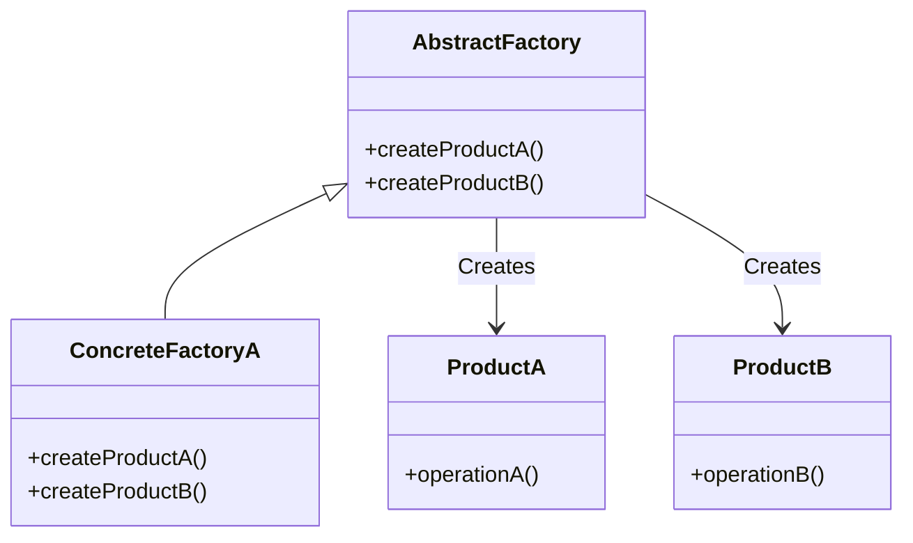

<details>
  <summary>**Sources & Resources**</summary>

  **Main Source**: [Abstract Factory | Refactoring Guru](https://refactoring.guru/design-patterns/abstract-factory)

  **Further Reading**:
  - [Abstract Factory | SwiftyLion](https://swiftylion.com/articles/abstract-factory)
  - [Abstract Factory | Design Patterns In Swift](https://github.com/ochococo/Design-Patterns-In-Swift?tab=readme-ov-file#-abstract-factory)
</details>

:::info[TL/DR]
The **Abstract Factory Pattern** is a creational design pattern that allows creating families of related objects while hiding their specific classes. This ensures consistency among related products and isolates clients from the concrete implementation details.
:::

### Concept Overview

The **Abstract Factory Pattern** revolves around three primary components:

1. **Factory**:
   - **Factory Protocol**: Declares an interface for creating abstract objects.
   - **Concrete Factories**: Implement the creation methods defined by the factory protocol.
   
2. **Product**:
   - **Product Protocol**: Defines the interface for related products.
   - **Concrete Products**: Implement the product protocols.

3. **Client**:
   - Uses factory and product interfaces, ensuring independence from specific implementations.



### Example in iOS: Car and Driver Factory

The following example implements a car and driver creation system using the Abstract Factory Pattern.

#### Product Protocols and Concrete Products
```swift
protocol Car {
    func drive()
    func canBeDriven(by driver: Driver) -> Bool
}

class ToyotaCar: Car {
    func drive() { print("Driving a Toyota") }
    func canBeDriven(by driver: Driver) -> Bool { driver is ProfessionalDriver }
}

class LamborghiniCar: Car {
    func drive() { print("Driving a Lamborghini") }
    func canBeDriven(by driver: Driver) -> Bool { driver is ProfessionalDriver }
}

protocol Driver {
    var name: String { get }
    var surname: String { get }
    func introduce()
}

class ProfessionalDriver: Driver {
    var name: String
    var surname: String
    init(name: String, surname: String) { self.name = name; self.surname = surname }
    func introduce() { print("I am a professional driver.") }
}

class NewbieDriver: Driver {
    var name: String
    var surname: String
    init(name: String, surname: String) { self.name = name; self.surname = surname }
    func introduce() { print("I am a newbie driver.") }
}
```

#### Factory Protocols and Concrete Factories
```swift
protocol Factory {
    func createCar() -> Car
    func hireDriver() -> Driver
}

class ToyotaFactory: Factory {
    func createCar() -> Car { ToyotaCar() }
    func hireDriver() -> Driver { ProfessionalDriver(name: "Fernando", surname: "Alonso") }
}

class LamborghiniFactory: Factory {
    func createCar() -> Car { LamborghiniCar() }
    func hireDriver() -> Driver { NewbieDriver(name: "John", surname: "Smith") }
}
```

#### Client Implementation
```swift
class Client {
    private var factory: Factory
    init(factory: Factory) { self.factory = factory }

    func testDrive() {
        let driver = factory.hireDriver()
        let car = factory.createCar()

        driver.introduce()
        car.drive()
        print("Can be driven: \(car.canBeDriven(by: driver))")
    }
}

// Usage
let toyotaClient = Client(factory: ToyotaFactory())
toyotaClient.testDrive()

let lamborghiniClient = Client(factory: LamborghiniFactory())
lamborghiniClient.testDrive()
```

### Pros and Cons

#### Pros:
- **Encapsulation**: Hides implementation details behind factory and product interfaces.
- **Flexibility**: Makes it easy to swap product families.
- **Consistency**: Ensures all related products work well together.

#### Cons:
- **Complexity**: Adds additional layers of abstraction.
- **Scalability**: Adding new product types may require extensive changes.

---

:::tip[In Bullets]
- The **Abstract Factory Pattern** facilitates the creation of related objects without specifying their concrete implementations.
- It includes **factories** and **products**, connected through well-defined protocols.
- Ideal for applications needing consistency among object families, such as theming or hardware compatibility.
:::