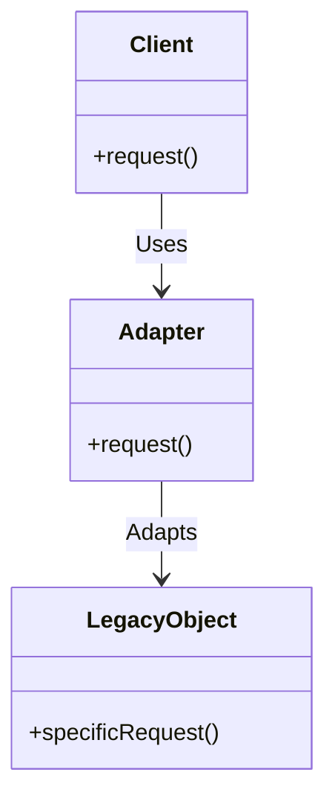

<details>  
  <summary>**Sources & Resources**</summary>  

  **Main Source**: Ray Wenderlich - Design Patterns by Tutorials (2019)  
  **Further Reading**:  
  - [Adapter | Refactoring Guru](https://refactoring.guru/design-patterns/adapter)
  - [Adapter | Design Patterns In Swift](https://github.com/ochococo/Design-Patterns-In-Swift?tab=readme-ov-file#-adapter)
</details>

:::info[TL/DR]  
The **Adapter Pattern** allows incompatible interfaces to work together by creating a bridge between them. It’s commonly used in iOS to integrate third-party libraries or services with the app’s own system by adapting their interface to match the expected one.
:::

### Concept Overview

The **Adapter Pattern** consists of the following components:

1. **Client**: The system or module expecting to use a specific interface.
2. **Adapter**: The class that implements the expected interface while internally communicating with the legacy or incompatible interface.
3. **Legacy Object**: The existing or third-party class that cannot be modified directly but needs to work with the client.

This pattern is useful when integrating third-party services like payment processors, authentication providers, or APIs, making them work seamlessly within your app.



### How Adapter Works:
1. **Client**: Expects a certain interface.
2. **Adapter**: Implements the interface and translates requests to the legacy object.
3. **Legacy Object**: The existing class that performs the actual work.

### Key Benefits:
- **Compatibility**: Allows you to integrate incompatible systems without modifying their source code.
- **Decoupling**: Reduces dependencies by separating the client from the legacy object directly.

### Playground Example

Here is an example of using the Adapter Pattern to integrate a third-party authentication service into an app:

```swift
import Foundation

// MARK: - Legacy Object
public class GoogleAuthenticator {
    public func login(email: String, password: String, completion: @escaping (GoogleUser?, Error?) -> Void) {
        let token = "special-token-value"
        let user = GoogleUser(email: email, password: password, token: token)
        completion(user, nil)
    }
}

public struct GoogleUser {
    public var email: String
    public var password: String
    public var token: String
}

// MARK: - New Protocol
public protocol AuthenticationService {
    func login(email: String, password: String, success: @escaping (User, Token) -> Void, failure: @escaping (Error?) -> Void)
}

public struct User {
    public let email: String
    public let password: String
}

public struct Token {
    public let value: String
}

// MARK: - Adapter
public class GoogleAuthenticatorAdapter: AuthenticationService {
    private let authenticator = GoogleAuthenticator()
    
    public func login(email: String, password: String, success: @escaping (User, Token) -> Void, failure: @escaping (Error?) -> Void) {
        authenticator.login(email: email, password: password) { (googleUser, error) in
            guard let googleUser = googleUser else {
                failure(error)
                return
            }
            let user = User(email: googleUser.email, password: googleUser.password)
            let token = Token(value: googleUser.token)
            success(user, token)
        }
    }
}

// Example Usage
let authService: AuthenticationService = GoogleAuthenticatorAdapter()
authService.login(email: "user@example.com", password: "password") { user, token in
    print("Logged in as \(user.email) with token \(token.value)")
} failure: { error in
    print("Login failed")
}
```

### How It Works:
- **Adapter**: The `GoogleAuthenticatorAdapter` class implements the `AuthenticationService` protocol expected by the app.
- **Legacy Object**: The `GoogleAuthenticator` class is used without being modified.
- **Client**: The app interacts with the `GoogleAuthenticatorAdapter` to perform login.

### When to Use

- **Third-Party Integration**: When you need to work with third-party services that have incompatible interfaces.
- **Legacy Code**: When adapting old code to work with new systems without changing the legacy code.

### When to Be Careful

- **Increased Complexity**: Using adapters can make code harder to maintain if overused, so it’s important to evaluate whether direct integration is possible.

---

:::tip[In Bullets]
- The **Adapter Pattern** bridges incompatible interfaces by wrapping legacy objects.
- Components include the **client**, **adapter**, and **legacy object**.
- Commonly used for **third-party service integration** or **legacy code adaptation**.
:::
