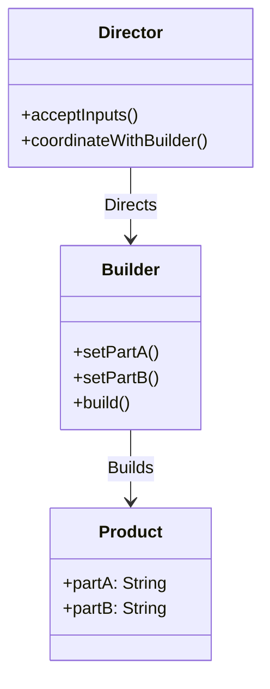

<details>  
  <summary>**Sources & Resources**</summary>  

  **Main Source**: Ray Wenderlich - Design Patterns by Tutorials (2019)  
  **Further Reading**:  
  - [Builder | Refactoring Guru](https://refactoring.guru/design-patterns/builder)
  - [Builder | Design Patterns In Swift](https://github.com/ochococo/Design-Patterns-In-Swift?tab=readme-ov-file#-builder)
  - [Exploring Builder Design Pattern in iOS | Kevin Topollaj](https://theiosmentor.hashnode.dev/exploring-builder-design-pattern-in-ios)
</details>

:::info[TL/DR]  
The **Builder Pattern** allows for the construction of complex objects by providing step-by-step inputs, instead of requiring all inputs upfront. It is particularly useful when an object needs multiple components or custom configurations.
:::

### Concept Overview

The **Builder Pattern** consists of three primary components:

1. **Director**: Accepts inputs and coordinates with the builder. Often implemented as a controller or helper class.
2. **Product**: The complex object to be created, often a class or struct, depending on desired reference semantics.
3. **Builder**: Accepts step-by-step inputs to create the product. This is typically a class to allow for reuse by reference.

This pattern is particularly useful for creating complex objects in iOS, such as when building a form or configuring a model with multiple parameters.



### How Builder Works:
1. **Director**: Takes the inputs and coordinates with the builder to construct the product.
2. **Builder**: Manages the actual creation, handling the addition of parts or customization.
3. **Product**: The final, fully-built object, assembled step-by-step by the builder.

### Key Benefits:
- **Customization**: Allows for the creation of complex products with various configurations.
- **Flexibility**: The builder can construct the product in any order, depending on the director's needs.

### Playground Example

Here is a basic example of the Builder Pattern used to build a hamburger:

```swift
import Foundation

// MARK: - Product
public struct Hamburger {
    public let meat: Meat
    public let sauces: Sauces
    public let toppings: Toppings
}

public enum Meat: String {
    case beef, chicken, tofu
}

public struct Sauces: OptionSet {
    public let rawValue: Int
    public static let ketchup = Sauces(rawValue: 1 << 0)
    public static let mustard = Sauces(rawValue: 1 << 1)
}

public struct Toppings: OptionSet {
    public let rawValue: Int
    public static let cheese = Toppings(rawValue: 1 << 0)
    public static let lettuce = Toppings(rawValue: 1 << 1)
}

// MARK: - Builder
public class HamburgerBuilder {
    public private(set) var meat: Meat = .beef
    public private(set) var sauces: Sauces = []
    public private(set) var toppings: Toppings = []

    public func setMeat(_ meat: Meat) {
        self.meat = meat
    }

    public func addSauces(_ sauce: Sauces) {
        sauces.insert(sauce)
    }

    public func addToppings(_ topping: Toppings) {
        toppings.insert(topping)
    }

    public func build() -> Hamburger {
        return Hamburger(meat: meat, sauces: sauces, toppings: toppings)
    }
}

// Usage example
let builder = HamburgerBuilder()
builder.setMeat(.chicken)
builder.addSauces(.mustard)
builder.addToppings([.cheese, .lettuce])

let burger = builder.build()
print("Built a \(burger.meat.rawValue) burger with toppings.")
```

### How It Works:
- **Director**: The `HamburgerBuilder` class acts as the director, collecting inputs and coordinating the creation process.
- **Builder**: Handles setting the meat, sauces, and toppings step-by-step before finalizing the product.
- **Product**: The `Hamburger` struct is the final product that is built and returned.

### When to Use

- **Complex Objects**: When creating an object that requires multiple configurations or parts, such as forms, game characters, or UI elements.
- **Incremental Construction**: When you need the flexibility to construct an object incrementally.

### When to Be Careful

- **Overhead**: If the object is simple and doesn’t require step-by-step construction, this pattern might introduce unnecessary complexity.
- **Order of Operations**: Ensuring that all necessary components are added before the object is built can require careful handling of logic.

---

:::tip[In Bullets]
- The **Builder Pattern** facilitates step-by-step construction of complex objects.
- It involves three main components: **director**, **builder**, and **product**.
- Useful for creating objects with multiple configurations, such as forms or game characters.
:::
