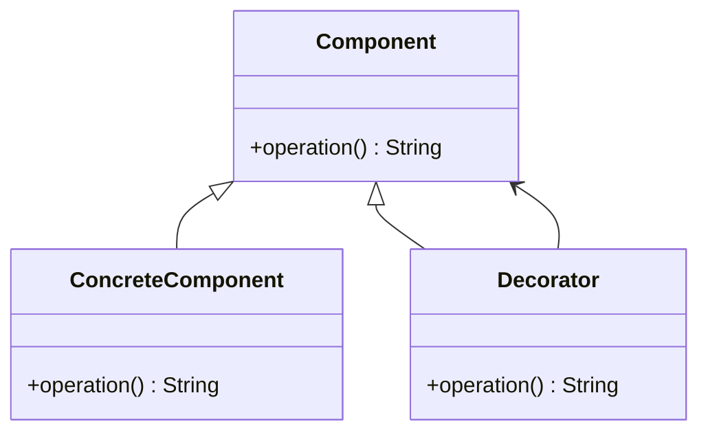

<details>
  <summary>**Sources & Resources**</summary>

  **Main Source**: [Adding Functionality to Legacy Code Without Modifying It | Islam Moussa](https://medium.com/@islammoussa.eg/adding-functionality-to-legacy-code-without-modifying-it-decorator-pattern-swift-ios-67bef115d501)

  **Further Reading**:
  - [Decorator | Refactoring Guru](https://refactoring.guru/design-patterns/decorator)
  - [Design Patterns in Swift by Tutorials | Ray Wenderlich](https://raywenderlich.com)
</details>

:::info[TL/DR]
The **Decorator Pattern** allows you to add functionality to an object dynamically without modifying its code. It uses composition to wrap an object with additional behavior.
:::

### Concept Overview

The **Decorator Pattern** is a structural design pattern that dynamically modifies or enhances the behavior of an object. Instead of extending a class with inheritance, the pattern relies on wrapping the object and delegating its behavior to add new functionality.

Key components:
1. **Component Protocol**: Declares the interface for objects that can be dynamically modified.
2. **Concrete Component**: The class implementing the component protocol (the object to be enhanced).
3. **Decorator Class**: Implements the component protocol and wraps the concrete component to add behavior dynamically.



### Example in iOS: Adding Functionality to Legacy Code

Here’s how the **Decorator Pattern** can enhance a legacy class without altering its original code.

#### Legacy Class
```swift
class LegacyClass {
    func doSomething() -> String {
        return "Legacy functionality"
    }
}
```

#### Component Protocol
```swift
protocol LegacyProtocol {
    func doSomething() -> String
}

extension LegacyClass: LegacyProtocol {}
```

#### Decorator Class
```swift
class Decorator: LegacyProtocol {
    private let wrapped: LegacyProtocol
    private let additionalFunctionality: () -> String

    init(wrapped: LegacyProtocol, additionalFunctionality: @escaping () -> String) {
        self.wrapped = wrapped
        self.additionalFunctionality = additionalFunctionality
    }

    func doSomething() -> String {
        let legacyResult = wrapped.doSomething()
        let additionalResult = additionalFunctionality()
        return "\(legacyResult) with \(additionalResult)"
    }
}
```

#### Usage
```swift
let legacyInstance: LegacyProtocol = LegacyClass()
let decoratorInstance = Decorator(wrapped: legacyInstance, additionalFunctionality: { "new functionality" })

print(legacyInstance.doSomething()) // Output: "Legacy functionality"
print(decoratorInstance.doSomething()) // Output: "Legacy functionality with new functionality"
```

### How It Works
1. **Component Protocol**: The `LegacyProtocol` ensures compatibility between the legacy class and the decorator.
2. **Concrete Component**: The `LegacyClass` provides the original functionality.
3. **Decorator**: The `Decorator` wraps `LegacyProtocol` and dynamically adds new functionality.

### Unit Testing
The **Decorator Pattern** is easily testable, ensuring that new functionality works as expected without impacting the original behavior.

```swift
import XCTest

class DecoratorTests: XCTestCase {
    func testDoSomething() {
        // Given
        let legacyInstance: LegacyProtocol = LegacyClass()
        let decoratorInstance = Decorator(wrapped: legacyInstance, additionalFunctionality: { "new functionality" })

        // When
        let result = decoratorInstance.doSomething()

        // Then
        XCTAssertEqual(result, "Legacy functionality with new functionality")
    }
}
```

### Benefits of the Decorator Pattern
1. **Extensibility**: Add functionality without altering existing code.
2. **Open/Closed Principle**: Supports open for extension and closed for modification.
3. **Flexibility**: Dynamically compose behaviors without inheritance.

### When to Use
- When extending functionality without subclassing.
- When working with legacy code or third-party libraries.
- To avoid a rigid class hierarchy.

### Limitations
- **Complexity**: Can lead to a system of many small objects.
- **Debugging**: Wrapped objects can make debugging and tracing behavior challenging.

---

:::tip[In Bullets]
- The **Decorator Pattern** enhances objects dynamically without altering their code.
- It involves **components**, **concrete implementations**, and **decorators**.
- Useful for adding new features to **legacy code** or **third-party libraries** without breaking existing functionality.
:::