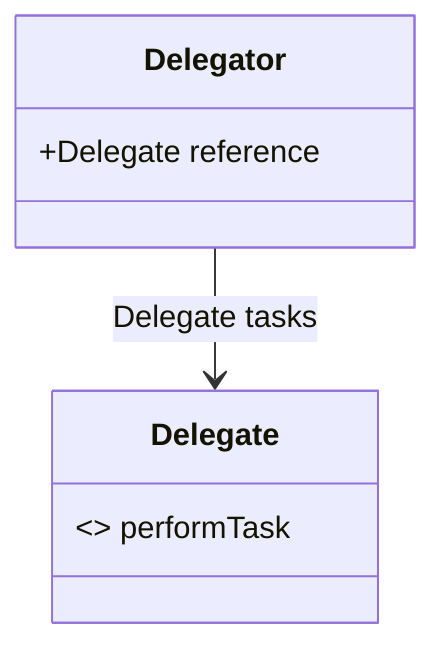

<details>
  <summary>**Sources & Resources**</summary>

  **Main Source:** Ray Wenderlich - Design Patterns by Tutorials (2019)

  **Further Reading:**

</details>

:::info[TL/DR]
The **Delegation Pattern** is a design pattern that enables one object (the delegator) to assign tasks to another object (the delegate). The delegate object must conform to a specific protocol, which defines the methods it must implement.
:::

### Concept Overview

The **Delegation Pattern** is fundamental in iOS, often used to enable one object to delegate tasks to another. This decouples the logic and allows each component to focus on a specific responsibility. In this pattern:

- **Delegator**: The object that assigns tasks to the delegate.
- **Delegate**: The object that performs the tasks, adhering to the delegate protocol.
  
This pattern is prevalent in UIKit components like **UITableView** and **UITextField**.



### How Delegation Works:
1. **Delegator Object**: The delegator keeps a reference to the delegate and assigns tasks.
2. **Protocol Definition**: The protocol defines the methods the delegate must implement.
3. **Delegate Object**: The delegate adheres to the protocol and performs the assigned tasks.

### Key Benefits:
- **Separation of Concerns**: The pattern allows breaking large classes into smaller, focused ones.
- **Reusability**: The same delegator can work with multiple delegates that conform to the protocol, making it flexible.

### Playground Example

Here’s a full example of using the **Delegation Pattern** with a `UITableView` and custom protocol.

```swift
import UIKit

// Define a protocol
protocol MenuViewControllerDelegate: AnyObject {
    func menuViewController(_ menuViewController: MenuViewController, didSelectItemAtIndex index: Int)
}

// Create the delegator
public class MenuViewController: UIViewController, UITableViewDelegate, UITableViewDataSource {
    
    @IBOutlet public var tableView: UITableView! {
        didSet {
            tableView.dataSource = self
            tableView.delegate = self
        }
    }
    
    private let items = ["Item 1", "Item 2", "Item 3"]
    public weak var delegate: MenuViewControllerDelegate?

    public func tableView(_ tableView: UITableView, numberOfRowsInSection section: Int) -> Int {
        return items.count
    }

    public func tableView(_ tableView: UITableView, cellForRowAt indexPath: IndexPath) -> UITableViewCell {
        let cell = tableView.dequeueReusableCell(withIdentifier: "Cell", for: indexPath)
        cell.textLabel?.text = items[indexPath.row]
        return cell
    }

    public func tableView(_ tableView: UITableView, didSelectRowAt indexPath: IndexPath) {
        delegate?.menuViewController(self, didSelectItemAtIndex: indexPath.row)
    }
}
```

### How It Works:
- **Delegator**: The `MenuViewController` assigns tasks to the delegate when a table row is selected.
- **Delegate**: The object implementing the `MenuViewControllerDelegate` protocol reacts when an item is selected.

### When to Use

- **Breaking Down Large Classes**: Use delegation when you need to split large classes into smaller, more manageable ones.
- **Flexible Communication**: Delegation is useful when different objects need to communicate, allowing flexibility through protocols.

### When to Be Careful

- **Retain Cycles**: Delegates are often declared as weak references to prevent retain cycles. Be cautious of strong references, which can cause memory leaks.
- **Overuse**: While helpful, having too many delegates in one object can make the class difficult to manage. If a class relies on multiple delegates, it may be doing too much and needs to be refactored.

---

:::tip[In Bullets]
- **Delegation** allows one object to delegate tasks to another.
- **Delegate Protocol**: Defines the methods the delegate must implement.
- **Weak References**: Commonly used to avoid retain cycles in memory management.
:::
