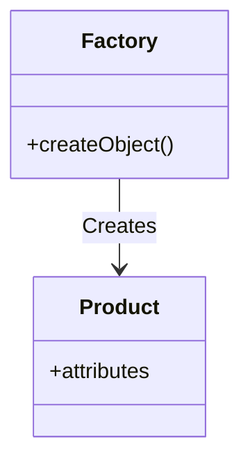

<details>  
  <summary>**Sources & Resources**</summary>  

  **Main Source**: Ray Wenderlich - Design Patterns by Tutorials (2019)  
  **Further Reading**:  
  - [Factory | Refactoring Guru](https://refactoring.guru/design-patterns/factory-method)
  - [Abstract Factory | Refactoring Guru](https://refactoring.guru/design-patterns/abstract-factory)
  - [Factory | Design Patterns In Swift](https://github.com/ochococo/Design-Patterns-In-Swift?tab=readme-ov-file#-factory-method)
</details>

:::info[TL/DR]  
The **Factory Pattern** is a creational pattern that provides a way to create objects without exposing the instantiation logic to the client. It delegates the responsibility of creating instances to a separate factory class.
:::

### Concept Overview

The **Factory Pattern** consists of two main components:

1. **Factory**: Handles the logic of object creation.
2. **Product**: The object that is created by the factory.

This pattern is particularly useful in iOS for scenarios where you need to create objects with multiple configurations or polymorphic objects that implement a common interface or inherit from a base class.



### How Factory Works:
1. **Factory**: The factory class contains the method to instantiate various types of products.
2. **Product**: The objects returned by the factory, which could be any subtype of a common interface or superclass.

### Key Benefits:
- **Decouples Object Creation**: Keeps object creation logic separate from the client.
- **Encapsulation**: Simplifies client code by hiding instantiation details.

### Playground Example

Here is an example of using the Factory Pattern to create email responses for job applicants:

```swift
import Foundation

// MARK: - Models
public struct JobApplicant {
    public let name: String
    public let email: String
    public var status: Status
    
    public enum Status {
        case new, interview, hired, rejected
    }
}

public struct Email {
    public let subject: String
    public let messageBody: String
    public let recipientEmail: String
    public let senderEmail: String
}

// MARK: - Factory
public struct EmailFactory {
    public let senderEmail: String

    public func createEmail(to recipient: JobApplicant) -> Email {
        let subject: String
        let messageBody: String

        switch recipient.status {
        case .new:
            subject = "We Received Your Application"
            messageBody = "Thanks for applying, \(recipient.name)!"
        case .interview:
            subject = "Interview Invitation"
            messageBody = "Dear \(recipient.name), please come for an interview."
        case .hired:
            subject = "Congratulations!"
            messageBody = "Welcome to the team, \(recipient.name)!"
        case .rejected:
            subject = "Thank You for Applying"
            messageBody = "Dear \(recipient.name), we regret to inform you that we have moved forward with other candidates."
        }

        return Email(subject: subject, messageBody: messageBody, recipientEmail: recipient.email, senderEmail: senderEmail)
    }
}

// Usage Example
let applicant = JobApplicant(name: "John Doe", email: "john@example.com", status: .interview)
let emailFactory = EmailFactory(senderEmail: "hr@example.com")
let email = emailFactory.createEmail(to: applicant)

print(email.subject) // Interview Invitation
```

### How It Works:
- **Factory**: The `EmailFactory` class is responsible for creating different types of emails based on the applicant’s status.
- **Product**: The `Email` object is the product created by the factory.

### When to Use

- **Polymorphic Object Creation**: When you have a group of related objects and need to manage their creation dynamically.
- **Simplifying Code**: To reduce duplication by centralizing object creation in a single factory.

### When to Be Careful

- **Overuse**: Simple object creation doesn’t always require a factory, so only use this pattern when needed.

---

:::tip[In Bullets]
- The **Factory Pattern** simplifies object creation by delegating it to a factory.
- It involves a **factory** and **products** that share a common interface or superclass.
- Useful for managing complex creation logic, especially for polymorphic objects.
:::
