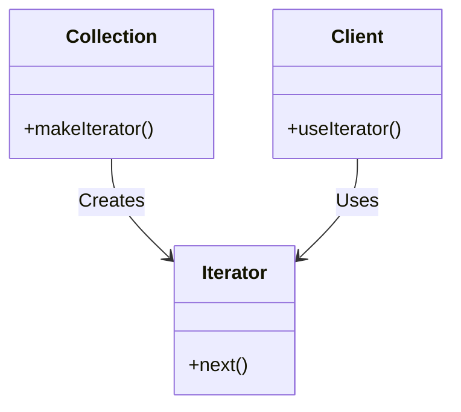

<details>  
  <summary>**Sources & Resources**</summary>  

  **Main Source**: Ray Wenderlich - Design Patterns by Tutorials (2019)  
  **Further Reading**:  
  - [Iterator | Refactoring Guru](https://refactoring.guru/design-patterns/iterator)
  - [Iterator | Design Patterns In Swift](https://github.com/ochococo/Design-Patterns-In-Swift?tab=readme-ov-file#-iterator)
</details>

:::info[TL/DR]  
The **Iterator Pattern** provides a standard way to traverse through a collection of objects without exposing the underlying representation. It helps in making custom objects iterable using Swift’s `for-in` syntax.
:::

### Concept Overview

The **Iterator Pattern** involves the following key elements:

1. **Iterator**: The object that provides the mechanism to traverse the collection.
2. **Iterable Collection**: The object or data structure that holds multiple elements.
3. **Client**: The code that uses the iterator to loop through the elements.

In Swift, it is common to conform to the `Sequence` protocol, which itself conforms to `IteratorProtocol`, and this enables the usage of high-order functions like `map`, `filter`, etc., "for free."



### How Iterator Works:
1. **Iterator**: Provides a method to get the next element from a collection.
2. **Collection**: Creates an iterator to traverse its elements.
3. **Client**: Uses the iterator to access elements in sequence.

### Key Benefits:
- **Encapsulation**: Hides the underlying structure of the collection from the client.
- **Standardization**: Provides a common way to traverse different types of collections.

### Playground Example

Here is an example of using the Iterator Pattern to build a queue system:

```swift
import Foundation

// MARK: - Iterator Collection (Queue)
public struct Queue<T> {
    private var array: [T?] = []
    private var head = 0
    
    public var isEmpty: Bool {
        return count == 0
    }
    
    public var count: Int {
        return array.count - head
    }
    
    public mutating func enqueue(_ element: T) {
        array.append(element)
    }
    
    public mutating func dequeue() -> T? {
        guard head < array.count, let element = array[head] else {
            return nil
        }
        array[head] = nil
        head += 1
        return element
    }
}

// MARK: - Conforming to Sequence Protocol
extension Queue: Sequence {
    public func makeIterator() -> IndexingIterator<ArraySlice<T?>> {
        let nonEmptyValues = array[head..<array.count]
        return nonEmptyValues.makeIterator()
    }
}

// Usage Example
var queue = Queue<String>()
queue.enqueue("Task 1")
queue.enqueue("Task 2")
queue.enqueue("Task 3")

for task in queue {
    print(task ?? "No Task")
}
```

### How It Works:
- **Iterator**: The iterator is created by conforming the `Queue` struct to the `Sequence` protocol.
- **Collection**: The `Queue` struct holds the elements and provides the `makeIterator()` method.
- **Client**: The `for-in` loop is used to iterate over the elements in the queue.

### When to Use

- **Custom Collections**: When you need to make a custom collection of objects iterable using standard Swift syntax.
- **Abstraction**: When you want to abstract the traversal logic of a complex object from the client.

### When to Be Careful

- **IteratorProtocol vs. Sequence**: It’s better to conform to `Sequence` rather than implementing `IteratorProtocol` directly, as `Sequence` provides higher-order functions like `map` and `filter`.

---

:::tip[In Bullets]
- The **Iterator Pattern** provides a standard way to iterate over a collection.
- Commonly implemented by conforming to Swift's **`Sequence`** protocol.
- Useful for **traversing custom collections** using the `for-in` syntax.
:::
