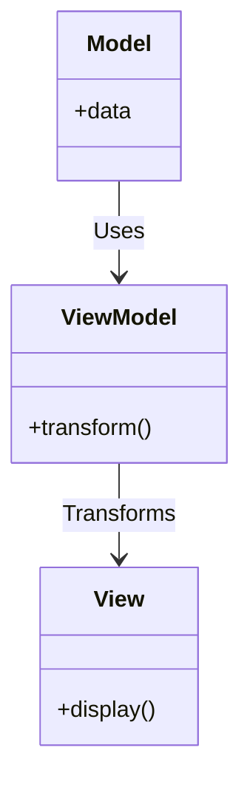

<details>  
  <summary>**Sources & Resources**</summary>  

  **Main Source**: Ray Wenderlich - Design Patterns by Tutorials (2019)  
  **Further Reading**:  
  - [MVVM Pattern in iOS by Apple](https://developer.apple.com)  
  - [Why you can use MVVM with SwiftUI: Debunking the Myth | Ade Adegoke](https://medium.com/@77adekunle/why-you-can-use-mvvm-with-swiftui-debunking-the-myth-cd9d26404cf4)
</details>

:::info[TL/DR]  
The **Model-View-ViewModel (MVVM)** Pattern separates an app’s logic into three components: **Model**, **View**, and **ViewModel**. It helps transform models into values suitable for display in a view and is used to reduce the complexity of view controllers.
:::

### Concept Overview

The **MVVM Pattern** consists of three main components:

1. **Model**: Represents the data or the state of the app. It’s often implemented as simple structs or classes.
2. **View**: Represents the UI elements responsible for displaying data to the user.
3. **ViewModel**: Transforms the data in the model into information that the view can present.

This pattern helps avoid overloading view controllers, often called "Massive View Controllers" (MVC), by offloading the responsibility of transforming model data to the view model.



### How MVVM Works:
1. **Model**: Contains the raw data and the logic to update it.
2. **ViewModel**: Transforms raw model data into a format that is easier for the view to present, often handling computed properties like date formats.
3. **View**: Displays the processed data from the view model.

### Key Benefits:
- **Simplified View Controllers**: Offloads much of the business logic to the view model, reducing the complexity of view controllers.
- **Separation of Concerns**: Maintains a clear division between the UI, data, and logic.

### Playground Example

Here’s an example of using the MVVM pattern to build a "Pet View" app for displaying pet details:

```swift
import UIKit

// MARK: - Model
public class Pet {
    public let name: String
    public let birthday: Date
    public let rarity: Rarity
    public let image: UIImage

    public init(name: String, birthday: Date, rarity: Rarity, image: UIImage) {
        self.name = name
        self.birthday = birthday
        self.rarity = rarity
        self.image = image
    }

    public enum Rarity {
        case common, uncommon, rare, veryRare
    }
}

// MARK: - ViewModel
public class PetViewModel {
    private let pet: Pet
    private let calendar: Calendar

    public init(pet: Pet) {
        self.pet = pet
        self.calendar = Calendar(identifier: .gregorian)
    }

    public var name: String {
        return pet.name
    }

    public var ageText: String {
        let components = calendar.dateComponents([.year], from: pet.birthday, to: Date())
        let age = components.year ?? 0
        return "\(age) years old"
    }

    public var adoptionFeeText: String {
        switch pet.rarity {
        case .common:
            return "$50"
        case .uncommon:
            return "$75"
        case .rare:
            return "$150"
        case .veryRare:
            return "$500"
        }
    }

    public var image: UIImage {
        return pet.image
    }
}

// Example Usage
let birthday = Calendar.current.date(byAdding: .year, value: -2, to: Date())!
let pet = Pet(name: "Whiskers", birthday: birthday, rarity: .veryRare, image: UIImage())
let viewModel = PetViewModel(pet: pet)

print(viewModel.name)  // "Whiskers"
print(viewModel.ageText)  // "2 years old"
print(viewModel.adoptionFeeText)  // "$500"
```

### How It Works:
- **Model**: The `Pet` class represents the raw data for the pet.
- **ViewModel**: The `PetViewModel` class transforms data from the `Pet` model to provide formatted outputs for the view.
- **View**: In a real app, the view would display the pet's name, age, and adoption fee.

### When to Use

- **Complex UI Logic**: Use MVVM when the view requires complex transformations of model data, such as formatting dates, currencies, or other complex UI logic.
- **Reducing ViewController Complexity**: When you find that your view controller is handling too much logic, MVVM can offload that responsibility.

### When to Be Careful

- **Overhead**: While MVVM can simplify controllers, it may introduce more complexity if the view model isn’t carefully designed. Avoid unnecessary logic inside view models.

---

:::tip[In Bullets]
- The **MVVM Pattern** separates concerns into **Model**, **View**, and **ViewModel** components.
- It helps reduce **view controller** complexity by offloading business logic.
- Useful for **UI logic transformation**, such as formatting data for display.
:::
