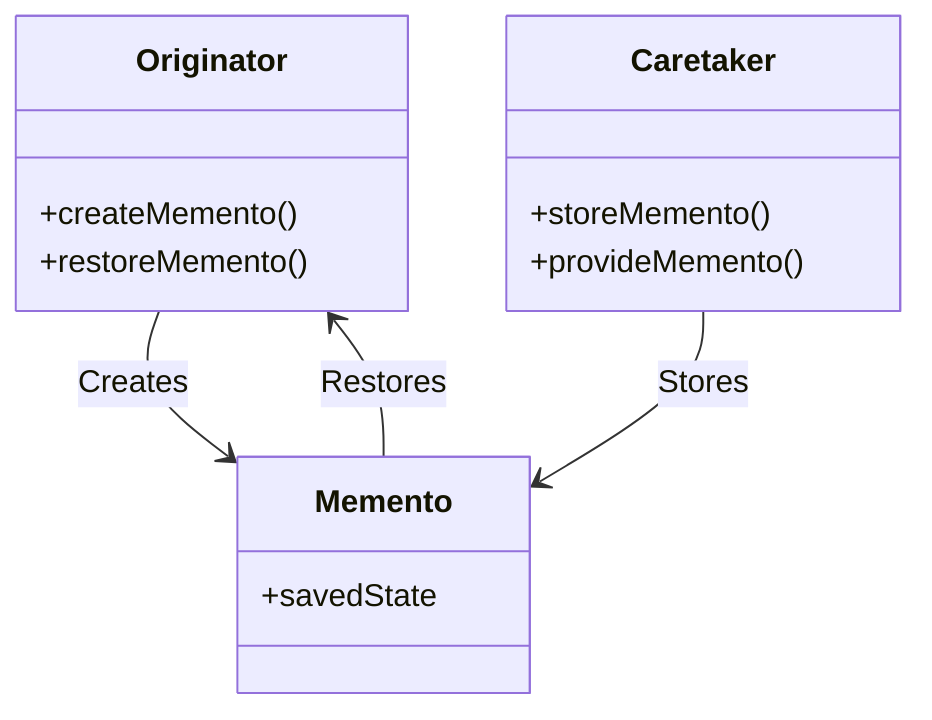

<details>  
  <summary>**Sources & Resources**</summary>  

  **Main Source**: Ray Wenderlich - Design Patterns by Tutorials (2019)  
  **Further Reading**:  
  - [Memento | Refactoring Guru](https://refactoring.guru/design-patterns/memento)
  - [Memento | Design Patterns In Swift](https://github.com/ochococo/Design-Patterns-In-Swift?tab=readme-ov-file#-memento)
</details>

:::info[TL/DR]  
The **Memento Pattern** allows an object to save its state and restore it later. It is useful for undo features, game saves, or any application that requires state restoration.
:::

### Concept Overview

The **Memento Pattern** consists of three primary components:

1. **Originator**: The object whose state you want to save and restore.
2. **Memento**: A representation of the stored state of the originator.
3. **Caretaker**: Manages the memento's persistence and can restore the originator’s state when needed.

This pattern is useful in scenarios where an object needs to be saved and restored to a previous state, such as saving game progress, undo functionality, or state management across sessions.



### How Memento Works:
1. **Originator**: Creates and restores its own state using the memento.
2. **Memento**: Holds the state of the originator at a specific time.
3. **Caretaker**: Requests the originator to save its state and provides the memento back when restoration is required.

### Key Benefits:
- **State Restoration**: Allows saving and restoring an object’s state.
- **Encapsulation**: Keeps the originator’s internal state hidden from external objects.

### Playground Example

Here is a simple example of using the Memento Pattern in a game:

```swift
import Foundation

// MARK: - Originator
public class Game: Codable {
    public class State: Codable {
        public var attemptsRemaining: Int = 3
        public var level: Int = 1
        public var score: Int = 0
    }
    
    public var state = State()

    public func rackUpPoints() {
        state.score += 1000
    }

    public func loseLife() {
        state.attemptsRemaining -= 1
    }
}

// MARK: - Caretaker
public class GameSystem {
    private let encoder = JSONEncoder()
    private let decoder = JSONDecoder()
    private let userDefaults = UserDefaults.standard

    public func save(_ game: Game, title: String) throws {
        let data = try encoder.encode(game)
        userDefaults.set(data, forKey: title)
    }

    public func load(title: String) throws -> Game {
        guard let data = userDefaults.data(forKey: title),
              let game = try? decoder.decode(Game.self, from: data) else {
            throw Error.gameNotFound
        }
        return game
    }

    public enum Error: String, Swift.Error {
        case gameNotFound
    }
}

// Example usage
var game = Game()
game.loseLife()
game.rackUpPoints()

let gameSystem = GameSystem()
try? gameSystem.save(game, title: "Save1")

game = Game()
print("New game score: \(game.state.score)")

game = try! gameSystem.load(title: "Save1")
print("Loaded game score: \(game.state.score)")
```

### How It Works:
- **Originator**: The `Game` class is the originator, managing the game’s state.
- **Memento**: The encoded state of the game, stored by the `GameSystem`.
- **Caretaker**: The `GameSystem` class stores and retrieves the game’s state.

### When to Use

- **Undo/Redo Functionality**: When you need to revert an object to a previous state.
- **State Persistence**: For saving and loading application states across sessions, such as game saves or document states.

### When to Be Careful

- **Overhead**: Saving and restoring large or complex objects can have performance implications.
- **Versioning Issues**: When the structure of the saved object changes, you may encounter difficulties restoring previous states unless properly managed.

---

:::tip[In Bullets]
- The **Memento Pattern** allows saving and restoring an object’s state.
- It is composed of an **originator**, **memento**, and **caretaker**.
- Useful for **undo/redo** functionality, game saves, and state persistence.
:::
