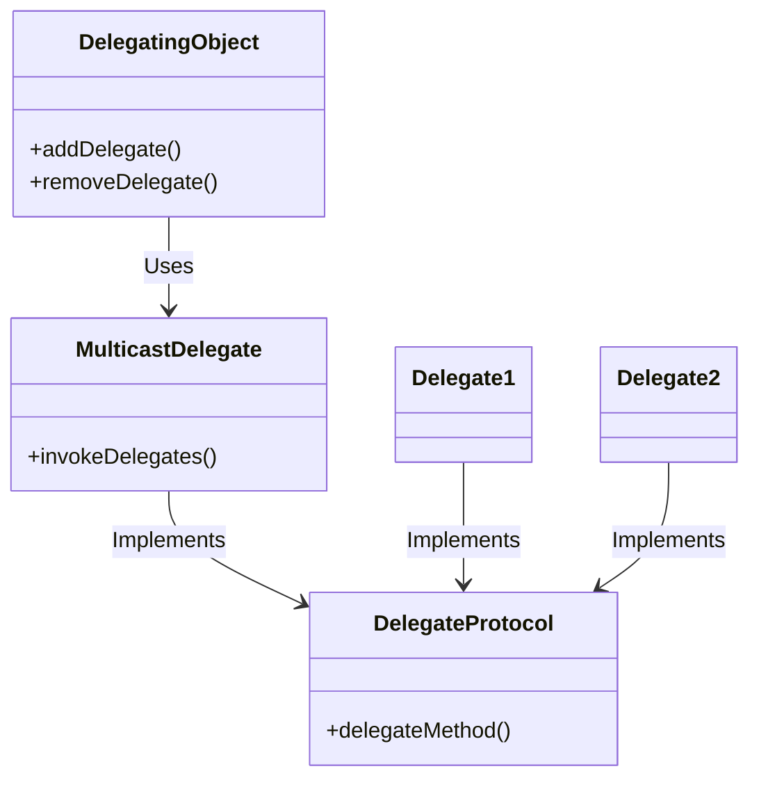

<details>  
  <summary>**Sources & Resources**</summary>  

  **Main Source**: Ray Wenderlich - Design Patterns by Tutorials (2019)  
  **Further Reading**:  

</details>

:::info[TL/DR]  
The **Multicast Delegate Pattern** allows one object to notify multiple delegates about an event, instead of having a one-to-one relationship like a traditional delegate pattern. This is useful when multiple objects need to respond to the same event.
:::

### Concept Overview

The **Multicast Delegate Pattern** consists of four main components:

1. **Delegating Object**: The object that has one or more delegates.
2. **Delegate Protocol**: Defines the methods a delegate should implement.
3. **Delegates**: The objects that implement the delegate protocol.
4. **Multicast Delegate**: A helper class that manages multiple delegates and notifies them about events.

This pattern is useful for broadcasting updates to multiple objects, such as notifying several UI components or services about a change.



### How Multicast Delegate Works:
1. **Delegating Object**: Holds a reference to the `MulticastDelegate` class and uses it to notify multiple delegates.
2. **Multicast Delegate**: Manages an array of delegates and forwards calls to them.
3. **Delegate Protocol**: All delegates conform to this protocol and implement its methods.

### Key Benefits:
- **One-to-Many Communication**: A single event can trigger responses from multiple objects.
- **Decoupling**: Keeps the delegating object decoupled from the logic of the delegates.

### Playground Example

Here’s an example of using the Multicast Delegate Pattern in an emergency response system:

```swift
import Foundation

// MARK: - Delegate Protocol
public protocol EmergencyResponding {
    func notifyFire(at location: String)
    func notifyCarCrash(at location: String)
}

// MARK: - Multicast Delegate
public class MulticastDelegate<ProtocolType> {
    private class DelegateWrapper {
        weak var delegate: AnyObject?
        
        init(_ delegate: AnyObject) {
            self.delegate = delegate
        }
    }
    
    private var delegateWrappers: [DelegateWrapper] = []
    
    public var delegates: [ProtocolType] {
        return delegateWrappers.compactMap { $0.delegate } as! [ProtocolType]
    }
    
    public func addDelegate(_ delegate: ProtocolType) {
        let wrapper = DelegateWrapper(delegate as AnyObject)
        delegateWrappers.append(wrapper)
    }
    
    public func removeDelegate(_ delegate: ProtocolType) {
        guard let index = delegateWrappers.firstIndex(where: { $0.delegate === (delegate as AnyObject) }) else { return }
        delegateWrappers.remove(at: index)
    }
    
    public func invokeDelegates(_ closure: (ProtocolType) -> Void) {
        for delegate in delegates {
            closure(delegate)
        }
    }
}

// MARK: - Delegates
public class FireStation: EmergencyResponding {
    public func notifyFire(at location: String) {
        print("Firefighters were notified about a fire at \(location)")
    }

    public func notifyCarCrash(at location: String) {
        print("Firefighters were notified about a car crash at \(location)")
    }
}

public class PoliceStation: EmergencyResponding {
    public func notifyFire(at location: String) {
        print("Police were notified about a fire at \(location)")
    }

    public func notifyCarCrash(at location: String) {
        print("Police were notified about a car crash at \(location)")
    }
}

// MARK: - Delegating Object
public class DispatchSystem {
    let multicastDelegate = MulticastDelegate<EmergencyResponding>()
}

// Example usage
let dispatch = DispatchSystem()
let policeStation = PoliceStation()
let fireStation = FireStation()

dispatch.multicastDelegate.addDelegate(policeStation)
dispatch.multicastDelegate.addDelegate(fireStation)

dispatch.multicastDelegate.invokeDelegates { $0.notifyFire(at: "Main Street") }
```

### How It Works:
- **Multicast Delegate**: Manages a list of weakly referenced delegates and ensures that each delegate receives the notification.
- **Delegates**: `FireStation` and `PoliceStation` implement the `EmergencyResponding` protocol to react to notifications.

### When to Use

- **One-to-Many Delegate Relationships**: When you need to notify multiple objects about the same event.
- **Decoupling Logic**: When you want to decouple the sender of an event from the receivers.

### When to Be Careful

- **Information Only**: This pattern works best for notifications. It’s not suitable when you need data from delegates, as multiple responses can cause conflicts.

---

:::tip[In Bullets]
- The **Multicast Delegate Pattern** enables one-to-many delegate relationships.
- Involves a **delegating object**, **delegate protocol**, **delegates**, and a **multicast delegate**.
- Useful for **broadcasting events** to multiple objects without creating tight dependencies.
:::
