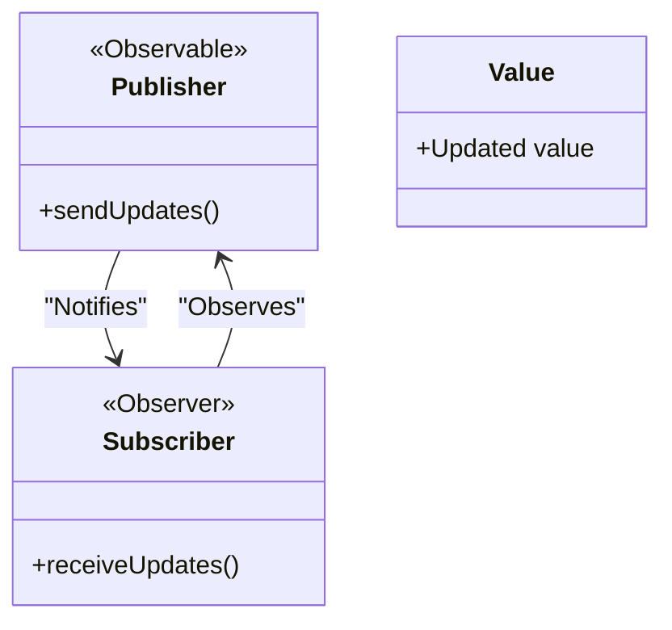

<details>  
  <summary>**Sources & Resources**</summary>  

  **Main Source**: Ray Wenderlich - Design Patterns by Tutorials (2019)  
  **Further Reading**:  
  - [Observer | Refactoring Guru](https://refactoring.guru/design-patterns/observer)
  - [Observer | Design Patterns In Swift](https://github.com/ochococo/Design-Patterns-In-Swift?tab=readme-ov-file#-observer)
</details>

:::info[TL/DR]  
The **Observer Pattern** allows one object to observe changes in another object. In Swift, this is often implemented using **Combine** with **Publisher** and **Subscriber** types.
:::

### Concept Overview

The **Observer Pattern** is about one object observing changes in another object. It involves three main roles:

- **Subscriber**: The "observer" object that receives updates.
- **Publisher**: The "observable" object that sends updates.
- **Value**: The underlying object whose changes are being observed.

The pattern is often used in conjunction with MVC, where the model (Publisher) communicates changes back to the view controller (Subscriber) without tight coupling between the two.



### How the Observer Pattern Works:
1. **Publisher**: An object that owns a value and notifies subscribers of changes.
2. **Subscriber**: An object that listens for updates to the value.
3. **Combine Framework**: Swift’s framework for handling asynchronous events, used to implement the observer pattern with `@Published` and `sink()`.

### Key Benefits:
- **Decoupling**: Separates concerns by allowing the model and view controller to remain unaware of each other's specific types.
- **Reactivity**: Automatically updates the UI in response to changes in the model, keeping everything synchronized.

### Playground Example

Here is an example using Swift’s Combine framework:

```swift
import Combine

// Publisher: User
public class User {
    @Published var name: String
    
    public init(name: String) {
        self.name = name
    }
}

// Example usage
let user = User(name: "Ray")
let publisher = user.$name

var subscriber: AnyCancellable? = publisher.sink { value in
    print("User's name is \(value)")
}

user.name = "Vicki"
subscriber = nil
user.name = "Ray has left the building"
```

### How It Works:
- **Publisher**: The `User` class publishes changes to its `name` property with the `@Published` annotation.
- **Subscriber**: The `sink()` method listens for changes to `user.name`.
- **Reactivity**: The subscriber receives the updated value and prints it to the console.

### When to Use

- **Changes in Model**: Use the Observer Pattern whenever changes to a model need to be reflected elsewhere in the app, such as the view or controller.
- **Reactivity**: When you want the UI to react to changes automatically without needing to manually update it.

### When to Be Careful

- **Overuse of @Published**: Not every property needs to be observable. Be selective about which properties should be marked as `@Published` to avoid performance overhead and complexity.
- **Tight Coupling**: Ensure that you're not introducing tight coupling between components, which defeats the purpose of the Observer Pattern.

---

:::tip[In Bullets]
- **Observer Pattern** enables communication between objects by allowing one to observe changes in another.
- Swift’s **Combine** framework provides **Publisher** and **Subscriber** for easy implementation.
- Be mindful of **overuse** of `@Published` properties.
:::
