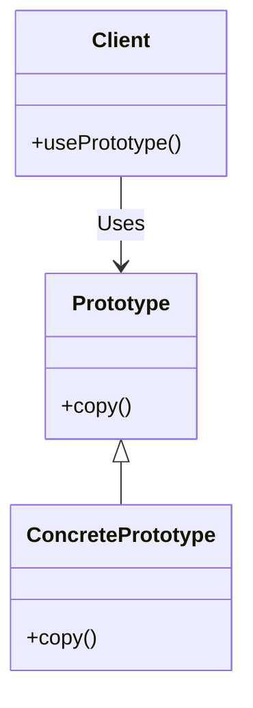

<details>  
  <summary>**Sources & Resources**</summary>  

  **Main Source**: Ray Wenderlich - Design Patterns by Tutorials (2019)  
  **Further Reading**:  
  - [Prototype | Refactoring Guru](https://refactoring.guru/design-patterns/prototype)
  - [Prototype | Design Patterns In Swift](https://github.com/ochococo/Design-Patterns-In-Swift?tab=readme-ov-file#-prototype)
  - [The Prototype Pattern in Swift: A Comprehensive Guide | SwiftlyNomad](https://swiftlynomad.medium.com/the-prototype-pattern-in-swift-a-comprehensive-guide-0201c72d6ab3)
</details>

:::info[TL/DR]  
The **Prototype Pattern** is a creational pattern that allows objects to clone themselves, providing a way to create new instances without knowing the exact type of the object beforehand. This pattern is useful when object creation is complex or resource-intensive.
:::

### Concept Overview

The **Prototype Pattern** consists of two main components:

1. **Prototype**: The object that provides the cloning functionality by implementing the `copy()` method.
2. **Client**: The entity that uses the prototype to create new instances by copying the original object.

This pattern is often used in iOS development when dealing with objects that are expensive to create or when you need to generate copies of an object without depending on its exact type.



### How Prototype Works:
1. **Prototype**: Declares the `copy()` method to create a clone of the object.
2. **Concrete Prototype**: Implements the cloning method, ensuring that the correct type and attributes are copied.
3. **Client**: Uses the prototype to clone the object without knowing the exact type of the object.

### Key Benefits:
- **Efficient Object Creation**: Allows the creation of new objects by copying existing ones, avoiding the need for expensive object initialization.
- **Encapsulation**: Hides the details of object creation from the client.

### Playground Example

Here’s an example of using the Prototype Pattern to clone game characters:

```swift
import Foundation

// MARK: - Prototype Protocol
public protocol Copying {
    init(_ prototype: Self)
}

extension Copying {
    public func copy() -> Self {
        return type(of: self).init(self)
    }
}

// MARK: - Concrete Prototype
public class Character: Copying {
    public var name: String
    public var health: Int
    public var level: Int

    public init(name: String, health: Int, level: Int) {
        self.name = name
        self.health = health
        self.level = level
    }

    public required convenience init(_ prototype: Character) {
        self.init(name: prototype.name, health: prototype.health, level: prototype.level)
    }
}

// Usage Example
let originalCharacter = Character(name: "Knight", health: 100, level: 5)
let clonedCharacter = originalCharacter.copy()

print("Original Character: \(originalCharacter.name), Level: \(originalCharacter.level)")
print("Cloned Character: \(clonedCharacter.name), Level: \(clonedCharacter.level)")
```

### How It Works:
- **Prototype**: The `Character` class implements the `Copying` protocol, providing a way to clone itself.
- **Concrete Prototype**: The cloned `Character` object is identical to the original, with all its attributes copied.
- **Client**: The client code calls `copy()` to clone the character.

### When to Use

- **Complex Object Creation**: When the process of creating an object is resource-intensive or involves complex setup.
- **Object Duplication**: When you need to create multiple copies of an object, such as game characters or data models.

### When to Be Careful

- **Shallow vs. Deep Copy**: Be mindful of whether you're performing a shallow copy (copying references) or a deep copy (duplicating the entire object).

---

:::tip[In Bullets]
- The **Prototype Pattern** allows objects to clone themselves to create new instances.
- It involves a **prototype** and a **client** that requests a copy.
- Useful for efficient **object duplication** and reducing object creation costs.
:::
