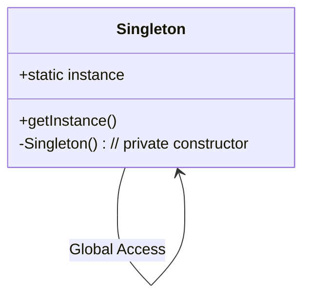

<details>
  <summary>**Sources & Resources**</summary>

  **Main Source:** Ray Wenderlich - Design Patterns by Tutorials (2019)

  **Further Reading:**
  - [Singleton | Refactoring Guru](https://refactoring.guru/design-patterns/singleton)
  - [Singleton | Design Patterns In Swift](https://github.com/ochococo/Design-Patterns-In-Swift?tab=readme-ov-file#-singleton)
</details>

:::info[TL/DR]
The **Singleton Pattern** restricts a class to a single instance and provides a global point of access to that instance. It is often used in iOS for managing shared resources or ensuring consistency throughout the app.
:::

### Concept Overview

The **Singleton Pattern** ensures that a class has only one instance, providing a global access point to that instance. It’s used frequently in iOS for things like app settings, managing global states, and coordinating shared resources. This pattern comes in two forms:
  
- **Singleton**: Only a single instance of the class exists.
- **Singleton Plus**: There’s a shared instance, but additional instances can be created if needed.



### How Singleton Works:
1. **Private Constructor**: The constructor is private to prevent direct instantiation.
2. **Shared Instance**: A static property provides access to the single instance.
3. **Lazy Instantiation**: The instance is only created when it is first accessed.

### Key Benefits:
- **Global Access**: Provides a shared instance that can be accessed from anywhere in the app.
- **Consistency**: Ensures that only one instance of a class exists, which is important for managing shared resources or states.

### Playground Example

Here’s an example of using the Singleton Pattern in an iOS app:

```swift
import Foundation

// MARK: - Singleton
public class AppSettings {
    // Static shared instance
    public static let shared = AppSettings()

    // Private initializer to prevent additional instances
    private init() { }

    // Example properties
    public var theme: String = "Light"
    public var language: String = "English"
}

// Usage
let settings = AppSettings.shared
settings.theme = "Dark"
print("App theme is: \(settings.theme)")
```

### How It Works:
- **Private Constructor**: `AppSettings` uses a private initializer to prevent creating multiple instances.
- **Shared Access**: The static `shared` instance allows global access to the settings.

### When to Use

- **Shared Resources**: Use the Singleton Pattern when you need to manage shared resources (e.g., settings, cache) across the entire app.
- **Global State**: When you need to enforce consistency, ensuring only one instance of the class is active.

### When to Be Careful

- **Overuse**: Singletons can introduce hidden dependencies and make unit testing difficult due to the global state they create.
- **Testing Challenges**: Mocking or replacing singletons in tests can be tricky, as they often introduce tightly coupled dependencies.

---

:::tip[In Bullets]
- **Singleton Pattern** restricts a class to one instance and provides a global access point.
- It is used for **shared resources** and **global states** in iOS apps.
- Be cautious of **overuse** and the potential impact on **unit testing**.
:::
