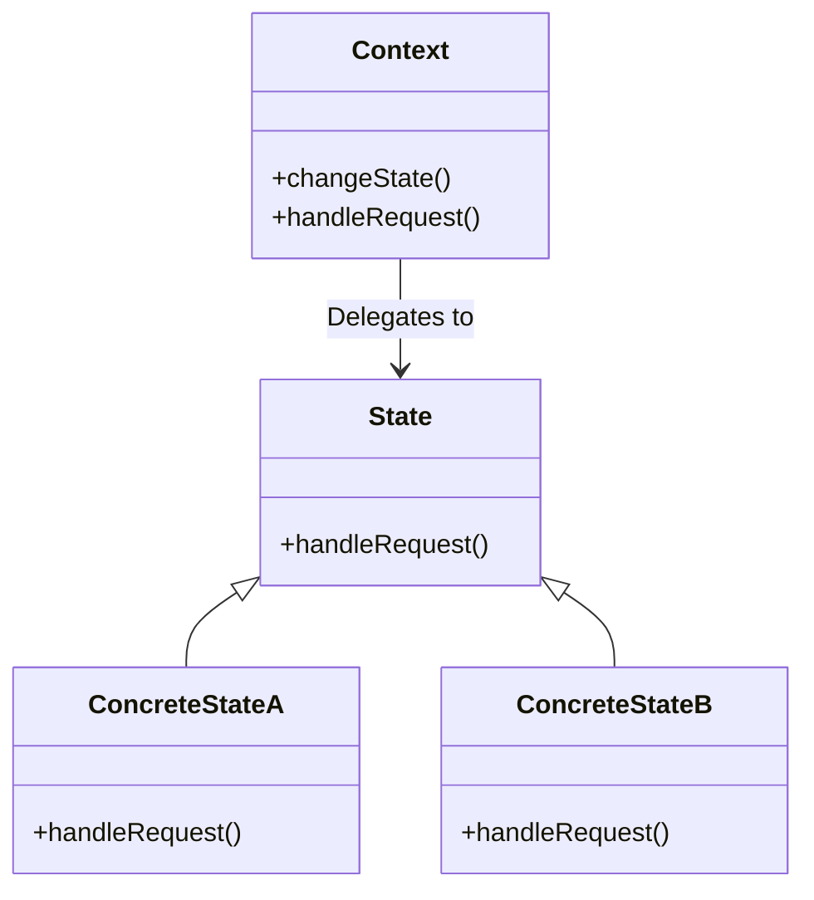

<details>  
  <summary>**Sources & Resources**</summary>  

  **Main Source**: Ray Wenderlich - Design Patterns by Tutorials (2019)  
  **Further Reading**:  
  - [State | Refactoring Guru](https://refactoring.guru/design-patterns/state)
  - [State | Design Patterns In Swift](https://github.com/ochococo/Design-Patterns-In-Swift?tab=readme-ov-file#-state)
</details>

:::info[TL/DR]  
The **State Pattern** allows an object to change its behavior based on its current state. It helps to avoid large `switch` or `if-else` statements and promotes better organization of state-based logic. This pattern is useful in systems that have multiple states, such as animations, game mechanics, or UI changes.
:::

### Concept Overview

The **State Pattern** consists of three primary components:

1. **Context**: The object that holds the current state and delegates behavior to the current state.
2. **State Protocol**: Defines the required methods and properties for states.
3. **Concrete States**: Implement the behavior associated with a particular state.

In iOS, the State Pattern can be used to handle various states of an object, such as a traffic light system or the different stages of an animation.



### How State Works:
1. **Context**: Maintains a reference to the current state.
2. **Concrete States**: Each state implements different behavior that the context delegates to.
3. **State Protocol**: Ensures all states have the required methods.

### Key Benefits:
- **Encapsulation**: The logic for each state is separated into different classes, promoting better organization.
- **Flexibility**: Adding new states or modifying behavior becomes easier without changing the context class itself.

### Playground Example

Here is an example of using the State Pattern to implement a traffic light system:

```swift
import Foundation

// MARK: - State Protocol
public protocol TrafficLightState {
    func handle(context: TrafficLight)
}

// MARK: - Concrete States
public class GreenState: TrafficLightState {
    public func handle(context: TrafficLight) {
        print("Green Light - Cars can go.")
        context.transition(to: YellowState())
    }
}

public class YellowState: TrafficLightState {
    public func handle(context: TrafficLight) {
        print("Yellow Light - Cars should prepare to stop.")
        context.transition(to: RedState())
    }
}

public class RedState: TrafficLightState {
    public func handle(context: TrafficLight) {
        print("Red Light - Cars must stop.")
        context.transition(to: GreenState())
    }
}

// MARK: - Context
public class TrafficLight {
    private var state: TrafficLightState

    public init(initialState: TrafficLightState) {
        self.state = initialState
    }

    public func request() {
        state.handle(context: self)
    }

    public func transition(to newState: TrafficLightState) {
        self.state = newState
    }
}

// Example usage
let trafficLight = TrafficLight(initialState: GreenState())
trafficLight.request()  // Green -> Yellow
trafficLight.request()  // Yellow -> Red
trafficLight.request()  // Red -> Green
```

### How It Works:
- **Context**: The `TrafficLight` class maintains a reference to the current state and delegates behavior to it.
- **State Transition**: Each concrete state (such as `GreenState`) defines what the next state should be and transitions the context to it.
- **State Protocol**: Ensures all states implement the `handle()` method.

### When to Use

- **State-Based Behavior**: When an object’s behavior depends on its current state and needs to change dynamically.
- **Avoiding Large Conditionals**: If your code relies on many `switch` or `if-else` statements based on state, the State Pattern can provide a cleaner solution.

### When to Be Careful

- **Overhead**: Be cautious if the number of states is small and the logic is simple, as introducing the State Pattern may introduce unnecessary complexity.

---

:::tip[In Bullets]
- The **State Pattern** allows objects to change behavior based on their state.
- Components include **context**, **state protocol**, and **concrete states**.
- Useful for systems with **state-based logic** such as traffic lights, animations, or game mechanics.
:::
