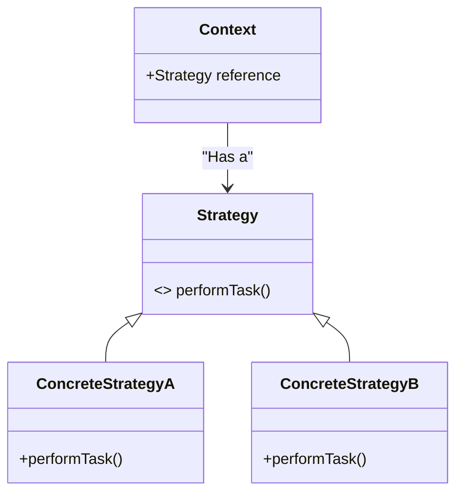

<details>
  <summary>**Sources & Resources**</summary>

  **Main Source:** Ray Wenderlich - Design Patterns by Tutorials (2019)

  **Further Reading:**
  - [Strategy | Refactoring Guru](https://refactoring.guru/design-patterns/strategy)
  - [Strategy | Design Patterns In Swift](https://github.com/ochococo/Design-Patterns-In-Swift?tab=readme-ov-file#-strategy)
  - [The Strategy Pattern | Vera Dias](https://codingwithvera.com/the-strategy-pattern/)
</details>

:::info[TL/DR]
The **Strategy Pattern** defines a family of interchangeable algorithms that can be selected at runtime. The pattern allows for different behaviors (strategies) to be chosen and swapped without changing the overall structure of the object using the strategy.
:::

### Concept Overview

The **Strategy Pattern** consists of three key parts:
- **Context**: The object that utilizes a strategy to perform a task.
- **Strategy Protocol**: Defines a set of methods that any strategy must implement.
- **Concrete Strategies**: Specific implementations of the strategy protocol that contain the actual algorithm or behavior.

The **Strategy Pattern** is commonly used when you need interchangeable behavior in your application without hard-coding decision logic into the context object. It allows you to select and switch between different strategies dynamically at runtime.



### How Strategy Works:
1. **Context Object**: The context holds a reference to a strategy object and delegates behavior to it.
2. **Concrete Strategies**: These classes implement the strategy protocol with specific behaviors.
3. **Interchangeability**: Strategies can be swapped at runtime, making the behavior of the context flexible.

### Key Benefits:
- **Open/Closed Principle**: New strategies can be added without modifying the existing codebase.
- **Separation of Concerns**: Each strategy focuses on a specific task, leading to cleaner code.
- **Reusability**: Strategies can be reused in different contexts.

### Playground Example

Here’s an example demonstrating the **Strategy Pattern** in an app that uses various movie rating services:

```swift
import UIKit

// Strategy Protocol
public protocol MovieRatingStrategy {
    var ratingServiceName: String { get }
    func fetchRating(for movieTitle: String, success: (_ rating: String, _ review: String) -> ())
}

// Concrete Strategy 1: Rotten Tomatoes
public class RottenTomatoesClient: MovieRatingStrategy {
    public let ratingServiceName = "Rotten Tomatoes"

    public func fetchRating(for movieTitle: String, success: (_ rating: String, _ review: String) -> ()) {
        // Dummy response for demonstration purposes
        let rating = "95%"
        let review = "It rocked!"
        success(rating, review)
    }
}

// Concrete Strategy 2: IMDb
public class IMDbClient: MovieRatingStrategy {
    public let ratingServiceName = "IMDb"

    public func fetchRating(for movieTitle: String, success: (_ rating: String, _ review: String) -> ()) {
        // Dummy response for demonstration purposes
        let rating = "8.7"
        let review = "A masterpiece!"
        success(rating, review)
    }
}

// Context
public class MovieRatingService {
    private var strategy: MovieRatingStrategy

    init(strategy: MovieRatingStrategy) {
        self.strategy = strategy
    }

    func changeStrategy(_ strategy: MovieRatingStrategy) {
        self.strategy = strategy
    }

    func fetchRating(for movieTitle: String) {
        print("Fetching rating from \(strategy.ratingServiceName)")
        strategy.fetchRating(for: movieTitle) { (rating, review) in
            print("Rating: \(rating), Review: \(review)")
        }
    }
}

// Usage
let movieService = MovieRatingService(strategy: RottenTomatoesClient())
movieService.fetchRating(for: "Inception")

movieService.changeStrategy(IMDbClient())
movieService.fetchRating(for: "Inception")
```

### How It Works:
- **Strategy Protocol**: `MovieRatingStrategy` defines the structure all strategies must follow.
- **Concrete Strategies**: `RottenTomatoesClient` and `IMDbClient` implement the protocol with their respective algorithms.
- **Context**: The `MovieRatingService` uses the strategy pattern to fetch movie ratings. The strategies can be swapped dynamically.

### When to Use

- **Multiple Behaviors**: When an object needs to exhibit multiple behaviors or use different algorithms, and these should be interchangeable.
- **Avoiding Conditional Logic**: Instead of hard-coding different behaviors using complex conditionals, the strategy pattern allows for cleaner and more maintainable code by delegating the behavior to separate classes.

### When to Be Careful

- **Overhead**: If overused, the strategy pattern can introduce overhead with too many classes.
- **Complex Strategy Selection**: You still need a mechanism to decide which strategy to use, which can sometimes be complex.

---

:::tip[In Bullets]
- **Strategy Pattern** allows interchangeable behaviors (strategies) at runtime.
- **Context** holds a reference to a **strategy** and delegates behavior to it.
- The pattern promotes the **Open/Closed Principle** by allowing new strategies without modifying existing code.
:::
