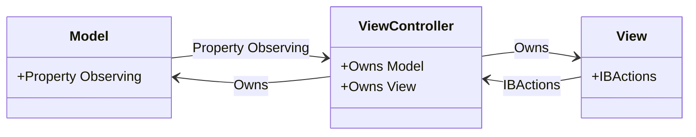

<details>
  <summary>**Sources & Resources**</summary>

  **Main Source:** Ray Wenderlich - Design Patterns by Tutorials (2019)

  **Further Reading:**
  - [MVC in iOS Development by Apple](https://developer.apple.com)
</details>

:::info[TL/DR]
The **Model-View-Controller (MVC)** pattern is a fundamental design pattern in iOS development that separates an app into three components:
- **Model**: Handles the data and business logic.
- **View**: Manages the UI elements.
- **Controller**: Acts as the mediator between the Model and View, updating both as needed.
:::

The Model-View-Controller (MVC) design pattern is a widely used architectural pattern in software development, particularly in iOS. It divides an application into three main components:

- **Model**: Represents the data and the business logic of the application. The model is responsible for managing the data, whether it's from a database, API, or other sources. It is independent of the user interface.
  
- **View**: The view is responsible for displaying the user interface and presenting data to the user. It observes the model for changes and updates the UI accordingly. In iOS, views are typically represented by `UIView` or `UIViewController` objects.

- **Controller**: The controller acts as an intermediary between the model and the view. It handles user input, updates the model, and refreshes the view. Controllers in iOS are commonly represented by `UIViewController` classes.



### How MVC Works:
1. **User Interaction**: The user interacts with the app through the view (e.g., tapping a button).
2. **Controller Handling**: The controller captures this interaction and processes the input.
3. **Model Update**: The controller updates the model based on the interaction.
4. **View Refresh**: The view observes changes in the model and updates the UI accordingly.


### Key Benefits:
- **Separation of Concerns**: Each component has a distinct responsibility, making the code easier to maintain and extend.
- **Reusability**: Components can be reused across different parts of the application or in other projects.
- **Testability**: With the logic separated, individual components can be tested independently.

### Playground Example

Here is a fully functional playground example demonstrating the MVC pattern in an address form application.

```swift
import UIKit

// MARK: - Address Model
public struct Address {
  public var street: String
  public var city: String
  public var state: String
  public var zipCode: String
}

// MARK: - Address View
public final class AddressView: UIView {
  @IBOutlet public var streetTextField: UITextField!
  @IBOutlet public var cityTextField: UITextField!
  @IBOutlet public var stateTextField: UITextField!
  @IBOutlet public var zipCodeTextField: UITextField!
}

// MARK: - Address View Controller
public final class AddressViewController: UIViewController {

  // MARK: - Properties
  public var address: Address?
  public var addressView: AddressView! {
    guard isViewLoaded else { return nil }
    return (view as! AddressView)
  }

  // MARK: - View Lifecycle
  public override func viewDidLoad() {
    super.viewDidLoad()
    updateViewFromAddress()
  }

  // MARK: - Helpers
  private func updateViewFromAddress() {
    guard let address = address else { return }
    addressView.streetTextField.text = address.street
    addressView.cityTextField.text = address.city
    addressView.stateTextField.text = address.state
    addressView.zipCodeTextField.text = address.zipCode
  }

  @IBAction public func updateAddressFromView(_ sender: AnyObject) {
    guard
      let street = addressView.streetTextField.text, street.count > 0,
      let city = addressView.cityTextField.text, city.count > 0,
      let state = addressView.stateTextField.text, state.count > 0,
      let zipCode = addressView.zipCodeTextField.text, zipCode.count > 0
    else {
      // TODO: show an error message, handle the error, etc.
      return
    }

    address = Address(street: street, city: city, state: state, zipCode: zipCode)
  }
}
```

### How It Works

- **Model**: The `Address` struct stores address information like street, city, state, and zip code.
- **View**: The `AddressView` contains `UITextField` outlets that correspond to the address fields.
- **Controller**: The `AddressViewController` manages the interaction between the model and the view. It updates the view when the model changes, and when the user inputs data, it updates the model accordingly.

### When to Use

- **Starting Point**: MVC is an excellent starting pattern for structuring iOS applications. It provides a clear division of responsibilities that make apps more maintainable.
- **Simple Applications**: This pattern works well for smaller projects or apps with simple user interfaces.
- **Reusability of Models and Views**: If you need to reuse certain models and views across multiple parts of your app, MVC allows for that by decoupling the business logic from the UI.

### When to Be Careful

- **Massive View Controller (MVC)**: In larger applications, it's common for view controllers to become bloated with too much logic, which can make the app harder to maintain. This is often referred to as **"Massive View Controller"**.
- **Not Always Flexible**: MVC works well for simpler applications, but when apps grow in complexity, other patterns like **MVVM** (Model-View-ViewModel) or **Coordinator** can be added to keep logic from overloading the controllers.


:::tip[In Bullets]
- **MVC** separates an application into **Model**, **View**, and **Controller** components.
- The **Model** holds the data, the **View** manages the UI, and the **Controller** acts as the intermediary between them.
- **Overloading the Controller** can lead to "Massive View Controller" syndrome, where the controller becomes difficult to manage.
:::
