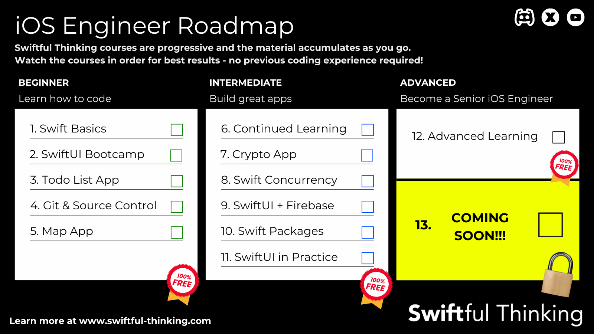

Swiftful Thinking's YouTube channel offers comprehensive video tutorials focused on Swift and SwiftUI. The content is designed to help developers of all skill levels improve their coding skills through detailed, step-by-step guides and practical examples.

**URL:** https://www.youtube.com/c/SwiftfulThinking

**Authors:** `Nick Sarno`

**Complexity Levels:**
   - **Beginner:** 40%
   - **Intermediate:** 40%
   - **Advanced:** 20%

**Frequency of Posting:** Irregular (course-based)

**Types of Content:**
   - **Tutorials:** 100% (Step-by-step video guides)

**Additional Features:**
   - **Playlists:** Curated playlists for structured learning.
   - **Community Discord:** Engagement with viewers and updates.

<LinkCard title="Visit Swiftful Thinking on YouTube" href="https://www.youtube.com/c/SwiftfulThinking" />

## iOS Engineer Roadmap

<LinkCard title="See the official watch order along with links here" href="https://www.swiftful-thinking.com/store" />

### Beginner Quick Links
1. [Swift Basics](https://www.youtube.com/playlist?list=PLwvDm4VfkdpiLvzZFJI6rVIBtdolrJBVB)
2. [SwiftUI Bootcamp](https://www.youtube.com/playlist?list=PLwvDm4VfkdphqETTBf-DdjCoAvhai1QpO)
3. [Todo List App](https://www.youtube.com/playlist?list=PLwvDm4VfkdpheGqemblOIA7v3oq0MS30i)
4. [Git & Souce Control](https://www.youtube.com/playlist?list=PLwvDm4VfkdpiALKk34l9mUS2f4mdJPvXq)
5. [Map App](https://www.youtube.com/playlist?list=PLwvDm4Vfkdpha5eVTjLM0eRlJ7-yDDwBk)

### Intermediate Quick Links
6. [Continued Learning](https://www.youtube.com/playlist?list=PLwvDm4VfkdpiagxAXCT33Rkwnc5IVhTar)
7. [Crypto App](https://www.youtube.com/playlist?list=PLwvDm4Vfkdphbc3bgy_LpLRQ9DDfFGcFu)
8. [Swift Concurrency](https://www.youtube.com/playlist?list=PLwvDm4Vfkdphr2Dl4sY4rS9PLzPdyi8PM)
9. [SwiftUI + Firebase](https://www.youtube.com/playlist?list=PLwvDm4Vfkdphl8ly0oi0aHx0v2B7UvDK0)
10. [Swift Packages](https://www.youtube.com/playlist?list=PLwvDm4VfkdphPRGbtiY-X3IZsUXFi6595)
11. [SwiftUI in Practice](https://www.youtube.com/playlist?list=PLwvDm4VfkdpiT7mKzjxfCYn_zaMC3Fmkz)

### Advanced Quick Links
12. [Advanced Learning](https://www.youtube.com/playlist?list=PLwvDm4Vfkdphc1LLLjCaEd87BEg07M97y)